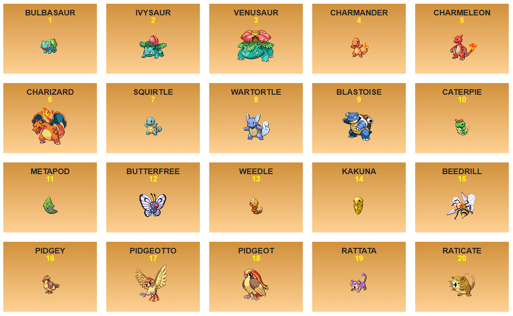

# Pokédex

Uma Pokédex interativa desenvolvida com React, onde é possível visualizar informações detalhadas dos Pokémon da primeira geração.

🚀 Acesse o projeto: [pokemon-pokedex-beryl.vercel.app](https://pokemon-pokedex-beryl.vercel.app/)

---

## 📸 Preview

 <!-- Altere ou adicione uma imagem do jogo se desejar -->

---

## 🛠 Tecnologias utilizadas

- [React](https://reactjs.org/)
- [Vite](https://vitejs.dev/)
- [Axios](https://axios-http.com/)
- [PokéAPI](https://pokeapi.co/)
- [CSS Modules](https://github.com/css-modules/css-modules)

## 📦 Instalação e uso

Siga os passos abaixo para rodar o projeto localmente:

```bash
# Clone o repositório
git clone https://github.com/seu-usuario/seu-repositorio.git

# Acesse a pasta do projeto
cd pokemon-pokedex

# Instale as dependências
npm install

# Rode o projeto
npm run dev
